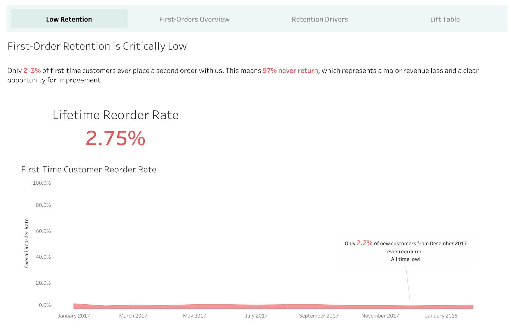
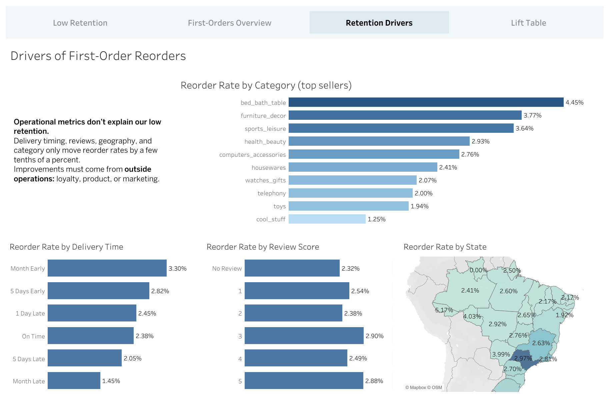

# Olist Customer Reorder Analysis & Prediction

- **Tableau Dashboard Suite:**  
  https://public.tableau.com/app/profile/thomas.howell2255/viz/OlistE-CommerceCustomerReorderAnalysis/First-OrderRetentionisCriticallyLow       
  <br>



## 1. Project Scope
**Target Audience:** Retention & E-Commerce Leadership\
**Business Problem:** Understand what drives first-order customers to reorder.

**Objectives:**
- Analyze first-order customer behavior
- Identify key drivers of reorder likelihood
- Build a binary classification model predicting 180-day reorders
- Communicate findings through a business-focused Tableau dashboard

**Business Value:**  
Enable Olist to allocate retention resources more efficiently by identifying which new customers are most likely to return.

**Deliverables:** 
- SQL-based Analytical Base Table
- Python notebooks for cleaning, EDA, and modeling
- Logistic regression model with feature interpretation
- Tableau dashboard with KPIs, trends, and drivers

## 2. Results Overview



### **Model Performance**
- **AUC:** 0.612  
- **Baseline reorder rate:** 2.75%  
- **Top 20% lift:** The highest-scoring customers reordered at **1.6×** the baseline rate.

Even with moderate predictive power, the model successfully concentrates higher-likelihood customers into the top scoring segments. This indicates that first-order behavior contains some useful signal for identifying customers with a higher chance of returning.

### **Behavioral and Business Insights**

Across all analyses and dashboards, several consistent patterns emerged:

- **Retention is structurally low.**  
  Only about 2–3% of first-time customers ever place a second order, and this rate remains stable over time. This suggests the issue is not caused by recent operational problems.

- **Operational experience does not meaningfully change reorder rates.**  
  Most deliveries arrive on time and most reviews are positive, yet these factors shift reorder rates by only a few tenths of a percent. Operational improvements alone are unlikely to move retention meaningfully.

- **Product category is the strongest differentiator.**  
  Customers buying from certain categories (e.g., bed_bath_table, furniture_decor, sports_leisure) reorder at noticeably higher rates than categories on the lower end. Category mix plays a clearer role than delivery timing or reviews.

- **Larger baskets correlate with higher reorder rates.**  
  Customers purchasing more items in their first order show higher reorder propensity (e.g., 2-item orders reorder around ~3.6%, and 4-item orders approach ~5%).  
  This relationship is correlational rather than causal, but it highlights meaningful behavioral differences in the customer base.

### **Overall Interpretation**
The analysis indicates that Olist’s low reorder rate is not primarily driven by fulfillment or review quality. Instead, differences in reorder likelihood appear to stem more from **what** customers buy and **how** they buy, rather than **how** the order was delivered.  

The model, while modest in accuracy, captures enough behavioral signal to differentiate higher-likelihood customers from the rest. Combined with the dashboard insights, the results paint a clear picture of where reorder behavior is strongest and where it is largely flat.

## 3. Dataset Overview

**Source:** Brazilian E-Commerce Public Dataset by Olist

The original Olist dataset includes nine CSV files. I added an additional income-by-state table to enhance geographic features.

**Tables:**
- Customers
- Orders
- Order Items
- Order Payments
- Products
- Reviews
- Sellers
- Product Category Translations
- Geolocations
- Brazil Median Income by State

These tables describe the full lifecycle of an E-Commerce order.

For this project, I combined them in SQL to build an ABT focused on each customer's first order, and whether they reordered within 180 days.

## 4. Major Project Steps

- **Database staging & ingestion**  
  Loaded all Olist raw tables (plus an external income-by-state file) into a PostgreSQL schema and validated keys, constraints, and indexes.

- **Analytical Base Table (ABT) + BI View construction**  
  Built a properly joined, leakage-safe ABT and a BI view to support downstream modeling and dashboarding.

- **Python-based EDA, feature engineering & modeling**  
  Performed ML-specific cleaning (handling missing data, encoding, transformations), engineered predictive features, trained ML models, and generated evaluation outputs (lift charts, AUC, decile analysis).

- **Tableau dashboard creation**  
  Designed stakeholder-friendly dashboards using the PostgreSQL BI view and exported model outputs. Added consistent navigation and layout elements for a polished multi-page reporting experience.

## 5. Project Structure

```text
project/
│   .env
│   .gitignore
│   README.md
│
├── assets/
│   └── figures/
│           lift_chart.png
│           top_25_correlation_features.png
│
├── data/
│   ├── interim/
│   │       deduped_olist_review_orders_dataset.csv
│   │
│   ├── processed/
│   │       dashboard_customer_first_order.csv
│   │       df_clean.csv
│   │       df_model.csv
│   │       first_order_customer_reorder_scores.csv
│   │       lift_table.csv
│   │
│   └── raw/
│           brazil_state_median_income_2017.csv
│           olist_customers_dataset.csv
│           olist_geolocation_dataset.csv
│           olist_orders_dataset.csv
│           olist_order_items_dataset.csv
│           olist_order_payments_dataset.csv
│           olist_order_reviews_dataset.csv
│           olist_products_dataset.csv
│           olist_sellers_dataset.csv
│           product_category_name_translation.csv
│
├── notebooks/
│       01_deduplicate_order_reviews.ipynb
│       02_eda_cleaning_feature_engineering.ipynb
│       03_modeling.ipynb
│
├── sql/
│       00_create_schema.sql
│       01_load_raw_data.sql
│       01b_add_indexes.sql
│       02_olist_build_abt.sql
│       03_build_bi_view.sql
│
└── tableau/
    ├── dashboards/
    │       first_order_dashboards.twbx
    │
    └── mockups/
            dashboard1_first_order_reorder_rate_mockup.png
            dashboard2_first_order_overview_mockup.png
            dashboard3_drivers_of_reorders_mockup.png
            dashboard4_topX_percentiles_mockup.png
```

## 6. How to Recreate This Project

### Prerequisites
- **Python 3.13+**
- **PostgreSQL 15+**  
  *(pgAdmin or any SQL client is optional — you only need the PostgreSQL server running locally.)*
- **Tableau Public**
- **Required Python libraries:**
  - numpy    
  - pandas    
  - matplotlib  
  - seaborn  
  - sqlalchemy  
  - python-dotenv  
  - scikit-learn  
  - xgboost 

### Steps

1. Clone the repo  
2. Download the Olist dataset from Kaggle:  
   https://www.kaggle.com/datasets/olistbr/brazilian-ecommerce
3. Place the `.csv` files into `/data/raw`
4. Run `notebooks/01_deduplicate_order_reviews.ipynb`
5. Sequentially run the following SQL scripts from inside the `sql` folder:

```text
00_create_schema.sql
01_load_raw_data.sql
01b_add_indexes.sql
02_olist_build_abt.sql
03_build_bi_view.sql
```

6. Update the `.env` file with your system's database credentials.
7. Sequentially run the following notebooks from inside the `notebooks` folder:

```text
02_eda_cleaning_feature_engineering.ipynb
03_modeling.ipynb
```

8. Open the Tableau packaged workbook (`first_order_dashboards.twbx`)  
   and reconfigure the two data sources (`dashboard_customer_first_order.csv` and `lift_table.csv`)  
   from `/data/processed`.

   
## 7. Conclusion

This project demonstrates an end-to-end analytics workflow across SQL, Python, and Tableau, focused on understanding what drives repeat purchasing behavior among first-time Olist customers. Despite the inherently low reorder rates and limited predictive signal, the analysis identifies clear behavioral patterns, clarifies which factors matter most, and highlights where future retention efforts could be informed by data. The project reflects industry-aligned practices in data engineering, modeling, and dashboard communication.

